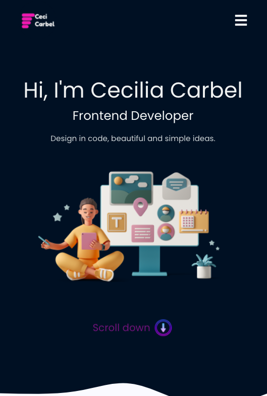

</a>

Ceci_Carbel Portfolio 🦄
============

## Introduction ☀️
The "Portfolio-Carbel" project it has some of the projects in which I have collaborated both individually and as a team. I like web development focused on Frontend Developer, participating in the process of creating a wonderful user experience and user interface. Thank you for visiting me..

## Starting 🌿 🌎
These instructions will allow you to get a working copy of the project on your local computer, for development and testing purposes:

Open terminal and run:
### `Frontend 🍒`
In the project directory, you can run:
  - Clone git https://github.com/belcar-ceci/belcar_ceci_portfolio to download the project, do a fork.
    ### `npm start`

  - Runs the app in the development mode.\
  - Open [http://localhost:3000](http://localhost:3000) to view it in your browser.

## Install 🌺

- npm install
- react-router-dom
- sweetalert
- uuid
- swiper
- react-scroll
## Project in production 🍀

Where to find the project in production:

## Desktop Version 💾

  

## Mobile First Version 🐝

  

## Tools 🏡

* Miró
* Figma
* ReactJS
* Javascript
* Html5
* Css3

## Authors🌻

* Cecilia Carbajal.

## Gratitude 🎁
* Tell others about this project 📢 .
* Support our projects 🐈‍⬛.
* Made with ❤️ by [Cecilia Carbajal 🐱](https://github.com/belcar-ceci/belcar_ceci_portfolio.git)
